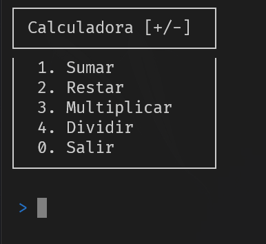
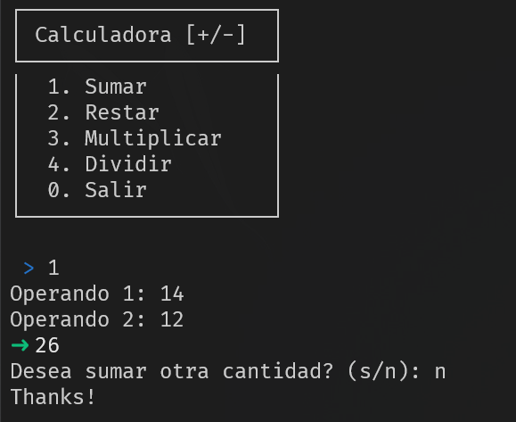

# Calc

Una calculadora básica e interactiva hecha en Bash!





## Instalación
Use [git](https://git-scm.com/) para clonar el repositorio de manera local.

```bash
git clone https://github.com/DosDev2/Calc.git
```

Acceda a la carpeta y otorgue permisos de ejecución al archivo.

```bash
chmod +x calc.sh
```

## Uso

```bash
./calc.sh
```

## Contribuyendo

Las solicitudes de incorporación de cambios son bienvenidas. Para cambios importantes, primero abra una incidencia para comentar que desea que cambiar. Asegúrese de actualizar las pruebas según corresponda.

## Licence

[MIT](https://choosealicense.com/licenses/mit/)
